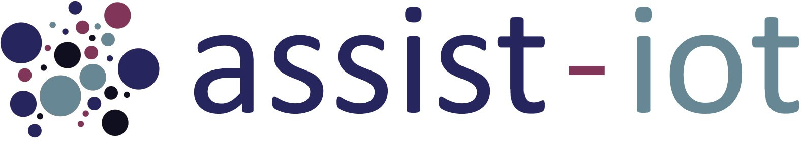

    
   

 

# Node-RED nodes for the [ASSIST-IoT](https://assist-iot.eu/) Composite services manager enabler

This *npm* package includes some Node-RED nodes that represent some ASSIST-IoT enablers (EDBE and LTSE), protocol translation agents (MQTT-HTTP and HTTP-MQTT) and a common HTTP Endpoint.

## Available Node-RED nodes

- [EDBE](https://assist-iot-enablers-documentation.readthedocs.io/en/latest/horizontal_planes/datamanagement/edge_data_broker_enabler.html)

- [LTSE](https://assist-iot-enablers-documentation.readthedocs.io/en/latest/horizontal_planes/datamanagement/long_term_data_storage_enabler.html)

- HTTP ENDPOINT

- MQTT-HTTP

- HTTP-MQTT